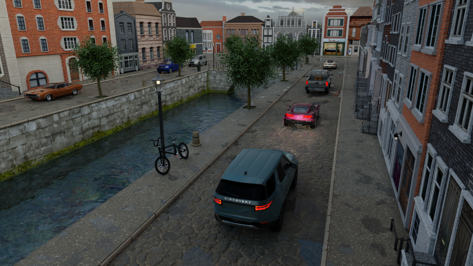

# W6DNet: Weakly-supervised Domain Adaptation for Monocular Vehicle 6D Pose Estimation with 3D Priors and Synthetic Data
This is the official repository for our paper `W6DNet: Weakly-supervised Domain Adaptation for Monocular Vehicle 6D Pose Estimation with 3D Priors and Synthetic Data`, published in IEEE Transactions on Instrumentation and Measurement.

This repository consists of the information about our synthetic traffic dataset, SynthV6D, and the implementation of W6DNet.

## SynthV6D dataset
### Traffic scene
SynthV6D dataset is rendered from 10 different virtual scenes, that is `City`, `Highway`, `Bridge over highway`, `Street`, `City center`, `Dutch City`, `Snow`, `Night scene`, `Tunnel`, and `Bridge`. Figure 1 shows screenshots of each scene.
<table>
  <tr>
    <td></td>
    <td></td>
    <td></td>
  </tr>
  <tr>
    <td></td>
    <td></td>
    <td></td>
  </tr>
  <tr>
    <td></td>
    <td></td>
    <td></td>
  </tr>
  <tr>
    <td></td>
    <!-- <td></td> -->
  </tr>
  <tr>
    <td colspan="3" style="text-align:center"><em>Figure 1: Image samples of each virtual scene.</em></td>
  </tr>
</table>

<div style="text-align: center;">
  <video width="auto" height="auto" controls>
    <source src="images/synthv6d/video samples of all scene 1080p.mp4" type="video/mp4">
    Your browser does not support the video tag.
  </video>
</div>

Each data sample is associated with `RGB image`, `vehicle 6D pose`, `vehicle instance map with 2D bounding boxes` and the corresponding `model and make`, and the counterpart `point cloud`,  which are shown in Figure 2.
<table>
  <tr>
    <td></td>
    
  </tr>
  <tr>
    <td colspan="1" style="text-align:center"><em>Figure 2: A data sample of SynthV6D. (a) RGB image. (b) Vehicle instance map with 2D bounding boxes and corresponding model and make. (c) The projection of the corresponding model and make vehicle point clouds using the 6D pose.</em></td>
  </tr>
</table>

### Download the dataset
Please contact yangxintong.lyu@vub.be if you would like to download SynthV6D.

## W6DNet

<table>
<tr>
<td></td>
</tr>
<tr>
    <td colspan="1" style="text-align:center"><em>Figure 3: W6dNet Pipeline.</em></td>
  </tr>
</table>

### Paper Results
- The inference results of Apollo `val` set by learning from 20% Apollo annotations can be found at `./paper_results/results/final_pred_pbbox.json`.
- The weights of W6DNet trained by 20% Apollo annotations can be downloaded via [the link](https://1drv.ms/u/s!AjfHqwRKa2zxb4GX0w-7H4WM-Ho?e=neH8Rw).

**If you would like to retrain W6DNet on your own dataset, please follow the instructions below.**
### Environment
Our implementation is only tested on NVIDIA GTX 3090 under the environment, follows:
```python
Ubuntu = 20.04
CUDA = 11.1
Python = 3.7.11
Conda = 4.10.3
```
You could find the conda package list in [`requirements.txt`](requirements.txt) file.

### Prepare the datasets
#### Write your own dataset
Please find our `apollo_style_dataset.py` file as an example.
#### Preprocessing Synthetic to Real transformation
You could retrain the S2T transformation by following the code from [official CycleGAN](https://github.com/junyanz/pytorch-CycleGAN-and-pix2pix). 

#### Extract the detected vehicles RoI
The RoIs can be extracted by using the 2D bbox labels or the results from a 2D object detection algorithm.
### Train the model
 ```python
python train.py --config config.yml
```

### Inference and Evaluation
 ```python
python test.py --config config.yml --weights ${YOUR_MODEL}.pth --output ${OUTPUT_FOLDER}
```

 ```python
python eval.py --pred_root ${PREDICTION_FILE}.json --anno ${GROUND_TRUE}.json --bbox_info ${BBOX_INFO}.json
```

### Citation
If you find this repository useful for your research, please cite our paper as follows:

```latex
@ARTICLE{10443331,
  author={Lyu, Yangxintong and Royen, Remco and Munteanu, Adrian},
  journal={IEEE Transactions on Instrumentation and Measurement}, 
  title={W6DNet: Weakly Supervised Domain Adaptation for Monocular Vehicle 6-D Pose Estimation With 3-D Priors and Synthetic Data}, 
  year={2024},
  volume={73},
  pages={1-13},
  doi={10.1109/TIM.2024.3363789}}
```